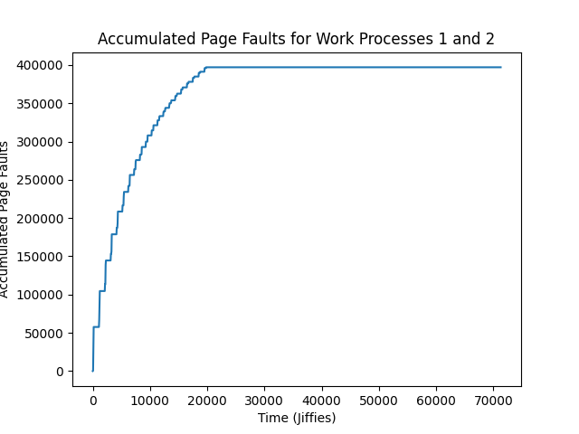
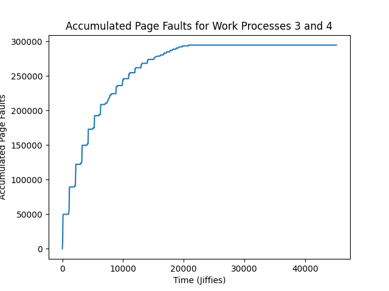
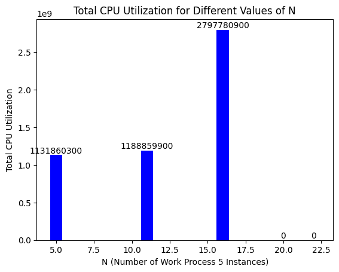

# Page Fault Profiler

# Case Study 1: Thrashing and Locality
Work process 1: 1024MB Memory, Random Access, and 50,000 accesses per iteration

Work process 2: 1024MB Memory, Random Access, and 10,000 accesses per iteration

```
nice ./work 1024 R 50000 & nice ./work 1024 R 10000 & ./monitor > /home/neo/cs423/mp0/linux-5.15.127/profile1.da
```



Work process 3: 1024MB Memory, Random Locality Access, and 50,000 accesses per iteration

Work process 4: 1024MB Memory, Locality-based Access, and 10,000 accesses per iteration

```
nice ./work 1024 R 50000 & nice ./work 1024 L 10000 & ./monitor > /home/neo/cs423/mp0/linux-5.15.127/profile2.data
```



The page fault rate the set of work processes with random accesses (work process 1 and work process 2) is steeper than the page fault rate for the work processes with one random access and one local access (work process 3 and work process 4).

Similarly, the total accumulated page faults seen is higher for the set of work processes with random accesses (work process 1 and work process 2) than the page fault rate for the work processes with one random access and one local access (work process 3 and work process 4).

The total execution time for work process 1 and 2 with only random accesses was significantly longer than the total execution time of work processes 3 and 4 with one process having the benefit of locality based access.

This can be trivially attributed to the benefit from having one process attempt to access memory locally. This reduces the chances of access a location in virtual memory that is not loaded into memory or close to another page table that is already loaded in memory thus only having to construct/load only one page table entry in the multi-level page tables. Due to the reduced likelyhood of page faults from locality or reducing the levels of page table entries to build, both the page fault rate and overall process time decrease from the benefits of locality based accesses.

# Case Study 2: Multiprogramming

Work process 5: 200MB Memory, Random Locality Access, and 10,000 accesses per iteration



The general trend is as N increases the CPU utilization increases. We expect this to only hold until a certain point where CPU utilization falls due to thrashing. As the CPU spends more time copying data and moving data between memory and the processor is overloaded. This is not seen in my chart as my VM kept crashing when trying to N > 16.
